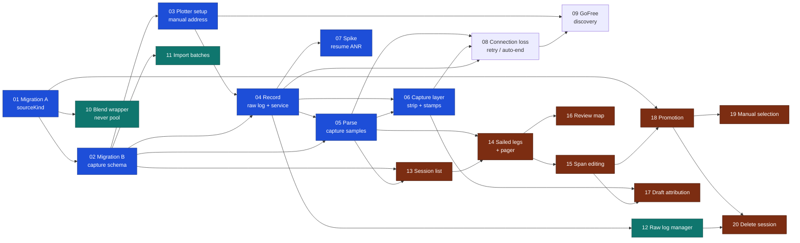

# Execution plan: building NMEA ingestion

How to run the twenty tickets in [`issues/`](issues/) — what can go in parallel,
where to stop and test on a phone, and where to run a review across several
tickets at once.

Source of truth for *what* to build is
[`../nmea-ingestion/spec.md`](../nmea-ingestion/spec.md). This file is only about
*order*.

**One-page visual board** — tickets, waves, hardware checks and review clusters
on a single chart:
<https://claude.ai/code/artifact/942ef2a8-cc2f-4f03-87f7-26c9f2869006>

**Prerequisite:** tech-debt
[`02`](../tech-debt/issues/02-duplicate-polar-points-zero-confidence.md) — the
grid-builder duplicate invariant — lands before ticket `01`.

---

## The dependency graph

Blue is the race-readiness path. Teal branches off and never blocks it. Brown is
the review-and-promotion chain, which is the long pole.

---

## Waves

Everything inside a wave can run in parallel. A wave starts when every ticket in
the previous one is done.

| Wave | Tickets | Notes |
| --- | --- | --- |
| 0 | `01` | Serial. Blocks literally everything |
| 1 | `02`, `10` | `10` branches off and never rejoins until `18` |
| 2 | `03`, `11` | |
| 3 | `04` | Serial — the whole transport layer |
| 4 | `05`, `07`, `12` | `07` is a spike; run it alongside, not after |
| 5 | `06`, `13` | **Race-readiness reached at the end of `06`** |
| 6 | `08`, `14` | |
| 7 | `09`, `15`, `16` | |
| 8 | `17`, `18` | Both need `15`; `18` also needs `01` |
| 9 | `19`, `20` | |

**Critical path is the review chain**, not the capture chain:
`01 → 02 → 03 → 04 → 05 → 13 → 14 → 15 → 18 → 19` — ten deep. If anything gets
extra hands, it is `13`/`14`.

**Genuinely parallel side branches**, each landing anywhere after its blocker:

- `10` (blend wrapper) — needs only `01`. Independent of every line of capture code.
- `11` (import batches) — needs only `02`.
- `12` (raw log manager) — needs only `04`.
- `07` (ANR spike) — needs only `04`.

---

## The race-day cut line

The spec is explicit: **the raw log is lossless**, so the minimum useful build is
connect → timestamped raw file → survive screen-off. Everything downstream can be
built later and replayed against that file.

| By Saturday | Ticket | Why |
| --- | --- | --- |
| **Must** | `01`–`04` | Without `04` there is no recording at all |
| **Should** | `05`, `06` | The strip is the only way to know it is working while racing |
| **Should** | `07` | The ANR fires on resume — exactly when you pick the phone up to stamp |
| **Strongly wanted** | `08` | Without it, one dropped socket silently ends the race recording |

If the day arrives with only `04` done, the race still survives as one file and
nothing is lost but the stamps — and `capture.py` in Termux is the independent
fallback either way.

Everything from `09` onward can be built at leisure, against the file the race
produced.

---

## Manual test checkpoints

There are no component or end-to-end tests and this feature does not add any. UI
and anything touching the socket, the service, SQLite or the filesystem is
verified by running the app on a device — and a claim about it must say what was
actually verified.

| # | After | What to verify on hardware |
| --- | --- | --- |
| **MT1** | `01`, `02` | Both migrations against a **populated** device database, not an empty one. The app opens; every existing polar row survives; read the generated SQL first. A failed migration is an app that will not open |
| **MT2** | `03` | Save plotter setup with `nmea-sim` down; **Test connection** succeeds with it up; switching boat profile switches the setup shown |
| **MT3** | `04` | **The race-readiness gate.** Over the hotspot rig: the no-internet WiFi trap (needs a **fresh install** — a phone that once accepted *stay connected* stops reproducing it), a 60 min+ recording with the screen off and the phone pocketed, raw log complete and parseable afterwards, Stop from the notification, and a failed connect leaving no session behind |
| **MT4** | `05` | A true 1 Hz row rate at twice race volume with no dropped writes; a fault-injected stale field produces `NULL`s, not repeated values |
| **MT5** | `06`, `07` | The strip on all 9 scrollable screens with the last card still reachable; two-tap stamping one-handed; the undo toast; hold-to-stop; and ten resume cycles inside one recording with no ANR |
| **MT6** | `08` | Pull the simulator's plug: greyed values, the retry ladder, vibration at 5 s and 60 s and then silence, recovery as one session with a gap, auto-end at the horizon, and resume |
| **MT7** | `09` | Two matching sources prompting rather than guessing; a port change mid-session followed; a pinned manual address never replaced |
| **MT8** | `14`, `15`, `16` | Review on a real phone at the real scale — **1–4 points per leg**, with a legitimately empty leg. Divider dragging and ±5 s nudges usable one-handed |
| **MT9** | `18` | The promotion comparison against your actual polar table, per sail per 10° band, before anything is written |
| **MT10** | `20` | Delete a promoted session and confirm the polar points went with it; then force a file-removal failure and check all three offered choices |

---

## Code-review checkpoints

Run these as independent reviews spanning several tickets, because each one has
an invariant that **only becomes visible across tickets** — a per-ticket review
cannot see it. Use `/code-review` against the merge-base of the cluster.

| # | Covers | The invariant only visible across the cluster |
| --- | --- | --- |
| **CR-A** | `01`, `02`, `10`, `11` | The data layer. Migration ordering, `notNull`-with-no-ORM-default actually forcing every writer to be explicit, provenance as an indexed predicate rather than a join, house integrity conventions |
| **CR-B** | `03`, `04`, `07`, `12` | Transport and service. Raw-first-parse-second ordering, `interface: 'wifi'` on every socket, **no JS timer anywhere on the capture path**, document storage never cache, file/DB failure handling |
| **CR-C** | `05`, `06`, `08` | The capture pipeline and layer. TTL-null never repeating a value forward, no derived columns, no manufactured rows across a gap, and **a stamp never propagating forward** — the load-bearing safety rule, which spans all three |
| **CR-D** | `13`, `14`, `15`, `16`, `17` | Review. **Spans claim time, not rows** — no sample ever carries a span id and no divider drag rewrites samples. Attribution failing closed. Review never manufacturing a stamp |
| **CR-E** | `18`, `19`, `20` | Promotion and withdrawal. The median applied **once**, one shared steadiness mask with three consumers, manual selection sharing the pipeline rather than forking it, withdrawal genuinely complete |
| **CR-F** | Everything | Final spec-conformance sweep. Specifically hunt for the spec's named recurring failure: **any second implicit trust knob** — a sample count, a confidence score, an emergent weight — that quietly means "captured data beats imported data". There is exactly one weight, and `16` owns it |

---

## Follow-on wave: after the first real race (18 August 2026)

Tickets `01`–`17` shipped and the race was sailed — >2 hrs of data, capture
itself worked. Review did not: **4 legs detected for a 7-leg race**, data
misfiled against the legs, and the map too small to check GPS coverage. Three
tickets, outside the original twenty:

| # | Ticket | Blocked by | Status |
| --- | --- | --- | --- |
| `21` | [Real-race replay harness](issues/21-real-race-replay-harness.md) | nothing | done |
| `22` | [Course-anchored leg detection](issues/22-course-anchored-leg-detection.md) | nothing | done |
| `23` | [Interactive review map](issues/23-interactive-review-map.md) | nothing | ready-for-agent |

`23` is unblocked; `21` and `22` are done. `21` landed 18 August 2026: Saturday's log and course are
now a committed fixture, the whole pipeline replays off-device in 3.7 s, and the
sailed truth — 8 roundings, 7 legs — is read off the track itself. It confirmed
every cause `22` predicted and added one warning `22` has to design around:
greedy closest-approach does **not** reproduce that truth on a course whose marks
are rounded twice. It also turned up something unexplained — off-device the same
code finds **9** legs where the phone reported 4, so the phone's stored samples
may not be what this log replays to, and two live defects in the DB layer that
`22` has to fix first — the review path never reads mark lat/lon, and
`courseMark.order` is all zeros on every course built through the UI. `22` now
carries the full hand-off: fixture, truth, algorithm, prerequisites, and the test
to flip. Promotion tickets `18`–`20` remain unbuilt and are unaffected.

`22` landed the same day. With a course linked, boundaries now come from where
the boat was against the marks — local minima per mark, then a monotonic
least-distance assignment over marks × candidates — and on the real race that
recovers **all 8 roundings within 1 s and all 7 legs correctly named**. Both DB
prerequisites are fixed (mark positions reach the review path; `courseMark.order`
is backfilled by migration and read as `(order, id)`), review can be re-detected
from the pager, and spec §6 records the reversal on GPS-based segmentation for
the course-linked case. The 9-vs-4 leg question is narrowed, not closed: the race
was recorded on the **preview** build, which is not debuggable, so its stored rows
cannot be read. Rebuilding the session in the dev app from the raw log reproduced
9 legs exactly, which clears replay and the DB write path and leaves the question
with the preview build's own data.

One correction from Logan the same day: the first North Head on that course is a
**via point** (routing around the peninsula), not a race mark, so the course is 7
legs as entered and 6 as raced. `22` anchors on all entries anyway — the
raced-versus-entered distinction waits on the via-points feature.

**Do not debug this by copying the preview database to the dev app.** The reasons
are recorded in `21` — the short version is that the raw log is already the
evidence, `replayCaptureSession` already replays it off-device, and the preview
APK is a release build that `adb run-as` cannot reach.

---

## Second follow-on wave: the review screen after real use (19 August 2026)

Review *worked* on Saturday's data once `22` landed — 7 legs, correctly named.
Using it is the problem. Four tickets:

| # | Ticket | Blocked by | Status |
| --- | --- | --- | --- |
| `24` | [Review screen prototype](issues/24-review-screen-prototype.md) | nothing | ready-for-agent |
| `25` | [Review screen rework](issues/25-review-screen-rework.md) | `24` | ready-for-agent |
| `26` | [What this leg is worth](issues/26-leg-point-preview.md) | `18`, `25` | ready-for-agent |
| `27` | [Review placement](issues/27-review-placement.md) | nothing | needs-triage |

`24 → 25` is the critical path and neither is blocked. **`18` is deliberately not
cannibalised**: the leg-level point preview that motivated much of this sits in
`26`, behind `18`, so promotion's pipeline is built once, by the ticket that owns
it. Everything the sailor complained about *except* the point preview is
independent of promotion and ships in `25`.

The load-bearing decision is in `25`: **`confirmedAt` splits into per-leg
`reviewedAt` and session-level promotion.** It reverses `14`'s
*advancing-the-pager-is-confirming* rule, which real use showed has no vocabulary
for pausing or roaming a 7-leg session. Watch the third consumer — `captureResume`
blocks resuming an auto-ended recording once a leg is confirmed, and if that
guard is lost, a resumed recording silently destroys hand-drawn spans via
`redetectCaptureReview`. `25` requires a test for exactly that.

`CONTEXT.md` was updated ahead of the work: **Reviewed** and **Promotion** added,
**Sail-attribution span** rewritten.

---

## Things to carry, not rediscover

- **A foreground service does not keep the socket alive in Doze.** MT5 measured
  it: `connectedDevice` FGS + `WAKE_LOCK`, deep Doze, no battery-optimisation
  exemption → Android destroys the TCP socket at **2 m 43 s** while process,
  service and notification all survive and the UI keeps showing a healthy
  recording. With the exemption: 13.7 min and counting. `04` now asks for the
  exemption. **Anything that opens a long-lived socket inherits this**, so `08`
  and `09` should not re-derive it.
- **`13`'s resume-burst hypothesis is disproven** (see `07`). There is no
  deferred delivery and no catch-up burst: largest gap over 13.7 min
  backgrounded was **0.2 s**, and the resume window is indistinguishable from
  any other ten seconds. **`05` does not need the coalesce-window redesign `13`
  opened on the strength of it.**
- **The no-internet WiFi trap is deterministic after all**, via
  `settings put global network_avoid_bad_wifi 1`. At the default `0` Android
  keeps unvalidated WiFi as the default route and the trap cannot be
  reproduced — a test that "passes" in that state proves nothing. `13` believed
  the trap could not be demonstrated on demand; it can.

- **§12 says "Nine new tables" and lists eight.** Reconcile against the bullet
  list while building `02`; do not invent a ninth.
- **`16` is still open** and blocked on real race data. `10` ships named interim
  constants (0.5 inside ±1 kn / ±10°, tapering). **Do not treat them as
  validated**, and do not add knobs beside them.
- **`08`'s 30-minute auto-end is a softening for this build only.** It reverts to
  five minutes once ticket `21` has characterised a real dropout. Keep it a named
  constant so that is a one-line change.
- **The trim defaults (25 s / 10 s) and the leg-detection tolerance are one
  decision.** The end trim exists to absorb the ±33 s detection error. Retune
  them together or not at all. `22` changes where boundaries come from when a
  course is linked, so it changes the error the trim is absorbing — revisit the
  pair there, not separately.
- **Legs are materialised exactly once.** `materializeCaptureReview` returns
  early on `session.reviewMaterializedAt`, so changing detection does **not**
  re-detect an existing session. Any detection change needs a re-detect path to
  be testable on a phone; `22` owns building one.
- **Leg detection was only ever measured against the simulator.** The spec's
  "14/14 roundings, 0 spurious, median error 33 s" came from the
  windward-leeward script — the geometry median-`|TWA|` handles best. The first
  real race found 4 of 7 legs. Treat simulator-measured detection numbers as a
  floor, not a validation.
- **The steadiness mask has never been measured on real data.**
  `findSteadyStretches` already runs per leg at materialisation
  (`draftAttribution.ts:314`) and already returns `medianBoatSpeed` /
  `medianTws` / `medianAbsTwa`, but no test exercises it and nobody knows how
  much of a real race it accepts. `saturday-race.log` is committed and replays
  off-device in 3.7 s, so this is cheap to answer. `24` gates its chart overlay
  on it; `18` and `26` both need the number.
- **The speed trace's top-right label is the axis ceiling, not a speed.**
  `traceGeometry.ts:5,50` computes `topSpeed = max(observed, 4) × 1.15`, so the
  trace reports a number ~15 % above anything sailed. Do not read it as a
  maximum, and do not reuse `topSpeed` as one. `24`/`25` fix the label.
- **Four risks land on race morning**, all recoverable at the berth and none once
  the lines are off: the plotter's Serial-output checkbox gating the Ethernet
  stream, an endpoint unknown until the day, `MWV,T` absent or status `V`, and a
  link-local address instead of a DHCP lease. Bring ticket
  [`04`](../nmea-ingestion/issues/04-capture-raw-sample-on-boat.md).
