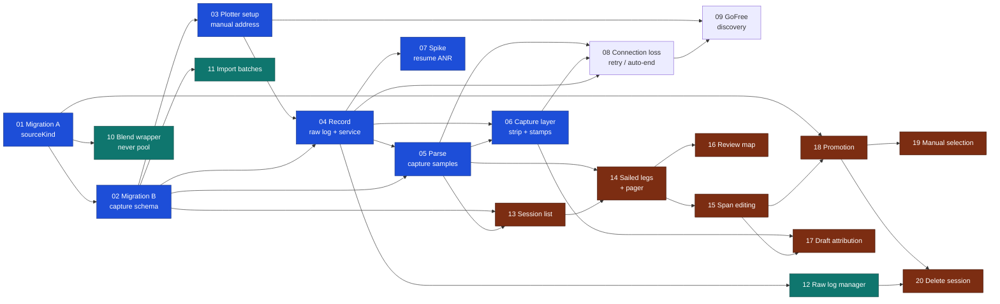

# Execution plan: building NMEA ingestion

How to run the twenty tickets in [`issues/`](issues/) — what can go in parallel,
where to stop and test on a phone, and where to run a review across several
tickets at once.

Source of truth for *what* to build is
[`../nmea-ingestion/spec.md`](../nmea-ingestion/spec.md). This file is only about
*order*.

**Prerequisite:** tech-debt
[`02`](../tech-debt/issues/02-duplicate-polar-points-zero-confidence.md) — the
grid-builder duplicate invariant — lands before ticket `01`.

---

## The dependency graph

Blue is the race-readiness path. Teal branches off and never blocks it. Brown is
the review-and-promotion chain, which is the long pole.

---

## Waves

Everything inside a wave can run in parallel. A wave starts when every ticket in
the previous one is done.

| Wave | Tickets | Notes |
| --- | --- | --- |
| 0 | `01` | Serial. Blocks literally everything |
| 1 | `02`, `10` | `10` branches off and never rejoins until `18` |
| 2 | `03`, `11` | |
| 3 | `04` | Serial — the whole transport layer |
| 4 | `05`, `07`, `12` | `07` is a spike; run it alongside, not after |
| 5 | `06`, `13` | **Race-readiness reached at the end of `06`** |
| 6 | `08`, `14` | |
| 7 | `09`, `15`, `16` | |
| 8 | `17`, `18` | Both need `15`; `18` also needs `01` |
| 9 | `19`, `20` | |

**Critical path is the review chain**, not the capture chain:
`01 → 02 → 03 → 04 → 05 → 13 → 14 → 15 → 18 → 19` — ten deep. If anything gets
extra hands, it is `13`/`14`.

**Genuinely parallel side branches**, each landing anywhere after its blocker:

- `10` (blend wrapper) — needs only `01`. Independent of every line of capture code.
- `11` (import batches) — needs only `02`.
- `12` (raw log manager) — needs only `04`.
- `07` (ANR spike) — needs only `04`.

---

## The race-day cut line

The spec is explicit: **the raw log is lossless**, so the minimum useful build is
connect → timestamped raw file → survive screen-off. Everything downstream can be
built later and replayed against that file.

| By Saturday | Ticket | Why |
| --- | --- | --- |
| **Must** | `01`–`04` | Without `04` there is no recording at all |
| **Should** | `05`, `06` | The strip is the only way to know it is working while racing |
| **Should** | `07` | The ANR fires on resume — exactly when you pick the phone up to stamp |
| **Strongly wanted** | `08` | Without it, one dropped socket silently ends the race recording |

If the day arrives with only `04` done, the race still survives as one file and
nothing is lost but the stamps — and `capture.py` in Termux is the independent
fallback either way.

Everything from `09` onward can be built at leisure, against the file the race
produced.

---

## Manual test checkpoints

There are no component or end-to-end tests and this feature does not add any. UI
and anything touching the socket, the service, SQLite or the filesystem is
verified by running the app on a device — and a claim about it must say what was
actually verified.

| # | After | What to verify on hardware |
| --- | --- | --- |
| **MT1** | `01`, `02` | Both migrations against a **populated** device database, not an empty one. The app opens; every existing polar row survives; read the generated SQL first. A failed migration is an app that will not open |
| **MT2** | `03` | Save plotter setup with `nmea-sim` down; **Test connection** succeeds with it up; switching boat profile switches the setup shown |
| **MT3** | `04` | **The race-readiness gate.** Over the hotspot rig: the no-internet WiFi trap (needs a **fresh install** — a phone that once accepted *stay connected* stops reproducing it), a 60 min+ recording with the screen off and the phone pocketed, raw log complete and parseable afterwards, Stop from the notification, and a failed connect leaving no session behind |
| **MT4** | `05` | A true 1 Hz row rate at twice race volume with no dropped writes; a fault-injected stale field produces `NULL`s, not repeated values |
| **MT5** | `06`, `07` | The strip on all 9 scrollable screens with the last card still reachable; two-tap stamping one-handed; the undo toast; hold-to-stop; and ten resume cycles inside one recording with no ANR |
| **MT6** | `08` | Pull the simulator's plug: greyed values, the retry ladder, vibration at 5 s and 60 s and then silence, recovery as one session with a gap, auto-end at the horizon, and resume |
| **MT7** | `09` | Two matching sources prompting rather than guessing; a port change mid-session followed; a pinned manual address never replaced |
| **MT8** | `14`, `15`, `16` | Review on a real phone at the real scale — **1–4 points per leg**, with a legitimately empty leg. Divider dragging and ±5 s nudges usable one-handed |
| **MT9** | `18` | The promotion comparison against your actual polar table, per sail per 10° band, before anything is written |
| **MT10** | `20` | Delete a promoted session and confirm the polar points went with it; then force a file-removal failure and check all three offered choices |

---

## Code-review checkpoints

Run these as independent reviews spanning several tickets, because each one has
an invariant that **only becomes visible across tickets** — a per-ticket review
cannot see it. Use `/code-review` against the merge-base of the cluster.

| # | Covers | The invariant only visible across the cluster |
| --- | --- | --- |
| **CR-A** | `01`, `02`, `10`, `11` | The data layer. Migration ordering, `notNull`-with-no-ORM-default actually forcing every writer to be explicit, provenance as an indexed predicate rather than a join, house integrity conventions |
| **CR-B** | `03`, `04`, `07`, `12` | Transport and service. Raw-first-parse-second ordering, `interface: 'wifi'` on every socket, **no JS timer anywhere on the capture path**, document storage never cache, file/DB failure handling |
| **CR-C** | `05`, `06`, `08` | The capture pipeline and layer. TTL-null never repeating a value forward, no derived columns, no manufactured rows across a gap, and **a stamp never propagating forward** — the load-bearing safety rule, which spans all three |
| **CR-D** | `13`, `14`, `15`, `16`, `17` | Review. **Spans claim time, not rows** — no sample ever carries a span id and no divider drag rewrites samples. Attribution failing closed. Review never manufacturing a stamp |
| **CR-E** | `18`, `19`, `20` | Promotion and withdrawal. The median applied **once**, one shared steadiness mask with three consumers, manual selection sharing the pipeline rather than forking it, withdrawal genuinely complete |
| **CR-F** | Everything | Final spec-conformance sweep. Specifically hunt for the spec's named recurring failure: **any second implicit trust knob** — a sample count, a confidence score, an emergent weight — that quietly means "captured data beats imported data". There is exactly one weight, and `16` owns it |

---

## Things to carry, not rediscover

- **§12 says "Nine new tables" and lists eight.** Reconcile against the bullet
  list while building `02`; do not invent a ninth.
- **`16` is still open** and blocked on real race data. `10` ships named interim
  constants (0.5 inside ±1 kn / ±10°, tapering). **Do not treat them as
  validated**, and do not add knobs beside them.
- **`08`'s 30-minute auto-end is a softening for this build only.** It reverts to
  five minutes once ticket `21` has characterised a real dropout. Keep it a named
  constant so that is a one-line change.
- **The trim defaults (25 s / 10 s) and the leg-detection tolerance are one
  decision.** The end trim exists to absorb the ±33 s detection error. Retune
  them together or not at all.
- **Four risks land on race morning**, all recoverable at the berth and none once
  the lines are off: the plotter's Serial-output checkbox gating the Ethernet
  stream, an endpoint unknown until the day, `MWV,T` absent or status `V`, and a
  link-local address instead of a DHCP lease. Bring ticket
  [`04`](../nmea-ingestion/issues/04-capture-raw-sample-on-boat.md).
